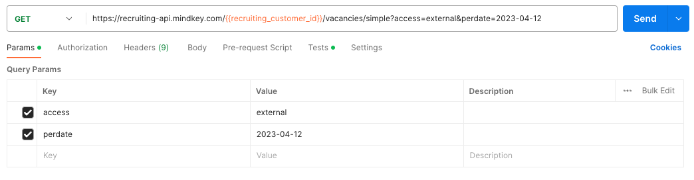
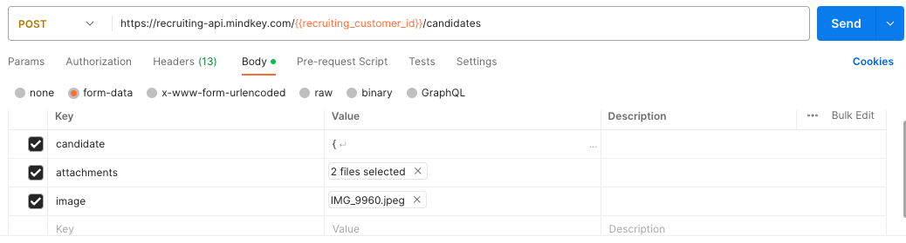

MindKey recruiting API is a REST API and it is hosted in Azure. Our API has predictable resource-oriented URLs, accepts form-data request bodies, returns JSON, and uses standard HTTP response codes, authentication and verbs.

The recruiting API can be called from the customer’s side through the **CustomerId**.

# Website sample

MindKey can deliver a sample website that shows how to use the API. The sample site consists of 3 pages:

- A list of vacancies
- A detail page for a single vacancy
- An application form

:::note
The sample includes some variations on the list page to illustrate different ways of displaying the vacancies.
:::

The list for the vacancies uses the **GET /vacancies/** to get information about the required vacancies, while the detail page uses **GET /vacancies/:id**.

The page with the application form uses **GET /candidates/lookups** to get the data for lookups on the application form. Then **POST /candidates/** to create an application in MindKey when the form is submitted.

# Testing the API

We recommend [Postman](https://www.postman.com/downloads/) as the tool to test our recruiting API.

## Getting a list of Vacancies

The following filtering method shows how to get in Postman a list of active vacancies at the predate and marked as external in your MindKey. If you don’t specify an access filter, vacancies marked as either “internal” or “external” will be included in the results.

:::caution
 Please note that the usage of the filters “internalAccess” and “externalAccess” is no longer supported. Instead the “access” filter as the preferred method.
:::

The Headers for the request are all default from Postman, except for **X-MindKey-User-Language: en-US**.

If you have defined language texts for vacancies in your MindKey, this header ensures you get the advertisements in the correct language.

## Creating a Candidate

When creating a candidate, you send a candidate object, and possibly also attached documents. For a detailed list of all the possible and mandatory fields on the candidate, see our **SwaggerHub**.

If you want MindKey to send an email receipt for the application, fill out the **candidateMailingTemplateId** field. The value of this field must be the ID of a valid mailing template in your MindKey. To get a list of possible IDs, you can use the **GET /candidates/lookups/mailingtemplates** endpoint.

The encoding **multipart/form-data** is used to send out the candidate and files. When testing in Postman, set the encoding of the request body as shown below.

See the [Mozilla web docs](https://developer.mozilla.org/en-US/docs/Web/API/FormData/Using_FormData_Objects) for more information on working with FormData in Javascript.

# Authorization

There is no API keys or login needed to access the API as the API is used on publicly available site that do not require a login. Instead, we have a check on the origin header of the request against a list of allowed origins. Due to that, you need to deliver a list of allowed origins to MindKey, to be able to access the API.

# Documentation

Our REST API is built on the OpenAPI specification, and the documentation is available on [SwaggerHub](https://recruiting-api.mindkey.com/swagger/index.html).

# Components of a REST API request/response

A REST API request/response pair has the following five components:

- The request URI, which consists of: {URI-scheme} :// {URI-host} / {resource-path} ? {query-string}. The request URI is called separately from the request message header as a convention required by most languages or frameworks.
  - URI scheme specifies the protocol needed to transfer the request, which can be either http or https. Mindkey Recruiting API only supports **https**.
  - URI host indicates the IP address or the server's domain name that hosts the REST service endpoint, which for MindKey is <https://recruiting-api.mindkey.com>.
  - Resource path determines the resource or resource collection. For instance, vacancies/JOB_01 can be used to get the specified properties for the vacancy.
  - Query string is optional and serves for adding simple parameters such as the location of a vacancy.
- HTTP request message header fields which are split into:
  - An enforced HTTP method that indicates the service what type of operation are requested. MindKey Recruiting REST API supports GET and POST methods.
  - Optional additional header fields, as required by the specified URI and HTTP method.
- Optional HTTP request message body fields needed for the URI AND HTTP operation.
- HTTP response message header fields, which can be separated into:
  - An HTTP status code, ranging from 2xx success codes to 4xx or 5xx error codes.
  - Optional additional header fields, supporting the request response, as the **Content-type** response header.
- Optional HTTP response message body fields:
  - MindKey recruiting API only supports the **JSON Content-type**.